# INTRO A DJANGO REST FRAMEWORK

Django REST Framework es una poderosa herramienta para crear API's Web, lo que facilita muchos pasos para crear el backend de una web sin problemas. 


**Ventajas** 
Algunas de las ventajas de DRF es que tiene el ORM incluido, lo que permite conectar a una base de datos SQLite3, además de poder conectar con PostgreSQL. 

Permite crear API's escalables, lo que quiere decir que si deseamos una mejora, podemos hacerlo de la mano de la documentación creada y desarrollada junto al proyecto.

### Paso a paso para crear nuestro entorno virtual

Recuerda que el entorno virtual hará que las librerías, paquetes y/o herramientas extras solo se instalen en esa carpeta para dicho proyecto, es decir, cada proyecto debe tener sus propias dependecias acorde a las necesidades del mismo. 

1. Debemos tener instalado Python y haber agreado al **PATH** la variable de la carpeta **bin**, con ello podemos manejar Python desde cualquier carpeta de nuestro equipo, abre una Terminal y ve hasta la carpet donde alojarás el proyecto

2. Ejecutamos el comando 

        > python -m venv env

3. Podremos ver que tal vez no hizo nada en la Terminal, pero si vamos a la carpeta desde el navegador de archivos veremos una carpeta llamada env, volvemos a la Terminal y escribimos el siguiente comando, con este comando activamos el entorno virtual: 

        > .\env\Scripts\activate

4. Ahora instalamos Django REST Framework:

        > pip install djangorestframework

5. Una vez instalado, procedemos a crear nuestro proyecto, recuerda que el punto al final es para hacer énfasis de crear el proyecto en la carpeta en la que estamos posicionados, de no poner el punto, nos creará otra carpeta:

        > django-admin startproject core .

6. La palabra **core** es el nombre de nuestro proyecto, depende de cada desarrollador como desee llamarlo

7. Ahora abrimos VSCode con el comando: 

        > code .

[Proyecto-DRF](https://github.com/MiriamZamoraM/library.git)

8. Recuerda agregar la librería instalada en **INSTALED_APPS** <br>
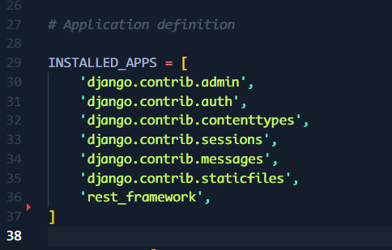

9. Ahora agregaremos un comentario con la siguiente línea *# LOCAL APPS* esto para las apps que vamos a crear, en este caso solo una

10. Regresemos a la terminal e instalemos 1 librería más para conectar esta prueba a PostgreSQL:

        > pip install psycopg2

11. Este paso es más un buen tip de buenas prácticas, una vez instalada esta librería, ejecuta el comando de abajo, lo que creará un archivo de librerías para este proyecto, de este modo cuando alguien quiera clonar tu repo, pueda instalar lo necesario desde este mismo archivo:

        > pip freeze > requirements.txt

12. Verás un archivo más o menos así:
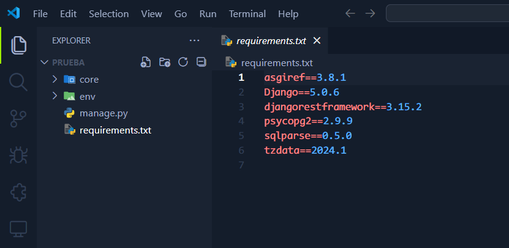

13. De regreso a la Terminal, crearemos nuestra primera app con el siguiente comando:

        > django-admin startapp library

14. En VSCode veremos una carpeta nueva con ese nombre <br>
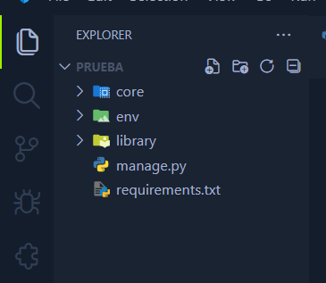

15. Ahora abrimos pgadmin, y desde nuestro servidor de bases de datos creamos una base de datos, el nombre es a elección y preferencia:
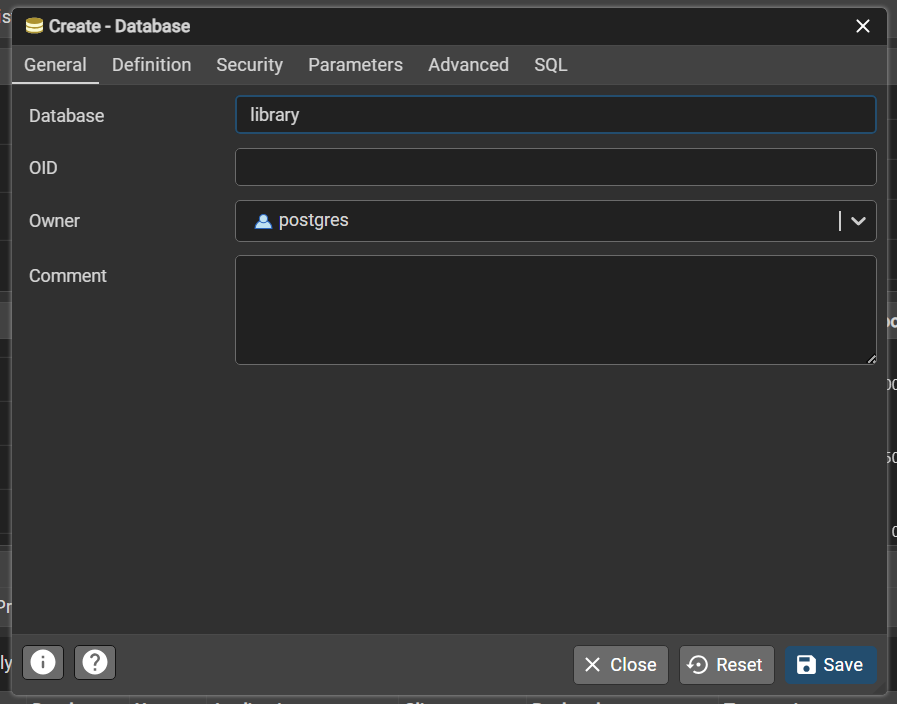

16. Una vez creada, regresamos a nuestro archivo `settings.py` en nuestra carpeta del proyecto, en este ejemplo la carpeta de **core**, nos ubicaremos en dónde se encuentra la conexión a SQLite3 y lo cambiamos por las siguientes líneas, en nuestro caso lo cambiaremos por las credenciales de usuario de postgres, así tal cual con comillas:
```
    DB_NAME = "nombre_de_la_base_de_datos"
    DB_USER = "nombre_del_usuario"
    DB_PASSWORD = "contraseña"
    DB_HOST = "localhost"
    DB_PORT = 5432

    if DB_NAME != "":
        DATABASES = {
            "default":{
                "ENGINE":"django.db.backends.postgresql",
                "NAME": DB_NAME,
                "USER": DB_USER,
                "PASSWORD": DB_PASSWORD,
                "HOST": DB_HOST,
                "PORT": DB_PORT,      
            }
        }
    else:
        DATABASES = {
        'default': {
            'ENGINE': 'django.db.backends.sqlite3',
            'NAME': BASE_DIR / 'db.sqlite3',
        }
    }
```

17. Con la conexión hecha podemos comprobar si hay errores con el comando:

        > python manage.py check

    En caso de error, contactame directamente y con gusto te apoyo

18. Pasemos a crear nuestro primer modelo, vamos al archivo `models.py` en nuestra carpeta library y escribimos lo siguiente:
```
from django.db import models

# Create your models here.

class Libros(models.Model):
    nombre = models.CharField(max_length=60, verbose_name='Nombre del libro')
    autor = models.CharField(max_length=250, verbose_name='Nombre del autor')
    isbn = models.IntegerField(default=0, verbose_name='ISBN')
    edicion = models.IntegerField(default=1, verbose_name='Número de edición')
    fecha_pub = models.DateField(verbose_name='Fecha de publicación')
    creado = models.DateTimeField(auto_now_add=True, verbose_name='Fecha de creación')
    status_delete = models.BooleanField(default=False)

    class Meta:
        db_table = 'libros'
```

La clase libros es para crear nuestro modelo, en SQL la llamaremos tabla. Y se verá algo así:
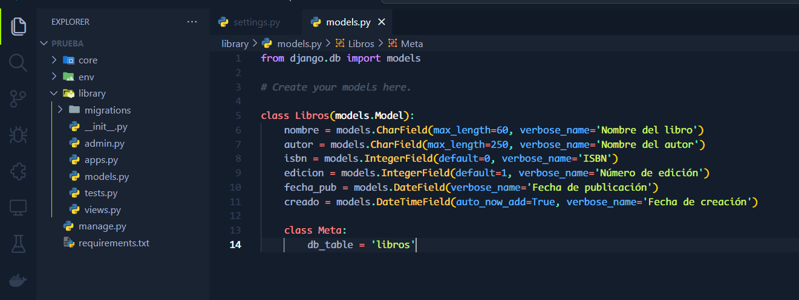

19. Ahora los serializers, que hacen la conversion de JSON a lenguaje Python y realizar las consultas a nuestra API y Base de Datos, para ello hay que crear el archivo dentro de la carpeta library con el nombre `serializers.py`:
```
from rest_framework import serializers
from .models import Libros


class LibroSerializer(serializers.ModelSerializer):
    class Meta:
        model = Libros
        fields = ('id', 'nombre', 'autor', 'isbn', 'edicion', 'fecha_pub', 'creado')

        def create(self, validated_data):

            libros = Libros.objects.create(**validated_data)

            return libros

```
Como hemos creado un campo de **status_delete** hay que omitirlo, ya que ese se modificará de una forma diferente con ayuda del CRUD

20. Ahora crearemos las vistas, para ello nos dirigimos al archivo `views.py` y escribimos lo siguiente:
```
from rest_framework.views import APIView
from rest_framework.response import Response
from rest_framework import status
from rest_framework.permissions import AllowAny

from .models import Libros
from .serializers import LibroSerializer

# Create your views here.

class LibroAPIView(APIView):
    permission_classes = (AllowAny, )

    def post(self, request):
        serializer = LibroSerializer(data=request.data)
        serializer.is_valid(raise_exception=True)
        serializer.save()
        return Response(serializer.data, status.HTTP_201_CREATED)

class LibrosRetrieve(APIView):
    permission_classes = (AllowAny, )

    def get(self, request):
        libros_list = Libro.objects.all()
        return Response(libros_list, status.HTTP_200_OK)
```

Son dos clases, la primera es para hacer registros de los libros y la segunda para ver los libros que hemos registrado, aún si estuvieran eliminados, nos mostraría los libros

21. Ahora crearemos las urls de nuestro proyecto, crearemos el archivo `urls.py` y escribimos lo siguiente:
```
from django.urls import path
from .views import LibroAPIView, LibrosRetrieve

urlpatterns = [
    path('alta/', LibroAPIView.as_view(),),
    path('lista/', LibrosRetrieve.as_view(),),
]
```
Cada url hace referencia a cada vista, y podemos verlo con los nombres de las vistas que están en cada una. 

22. Ahora ya tenemos nuestra app sencilla, pero debemos hacer otro cambio, vamos al archivo `urls.py` de la carpeta **core** para dar de alta la app que hemos creado con las siguientes líneas: 
```
from django.contrib import admin
from django.urls import path, include

urlpatterns = [
    path('admin/', admin.site.urls),
    path('api/libros/', include('library.urls')),
]
```

23. Vamos de nuevo al archivo `settings.py` y recuerdas el comentario del paso 9, bueno abajo del comentario escribimos el nombre de nuestra app, en este caso **library** y se verá algo así: <br>
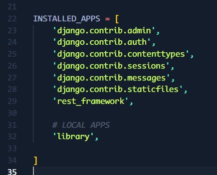

24. Con todos estos pasos hechos, guarda cada cambio en su respectivo archivo y haz un check para verificar que no haya errores:
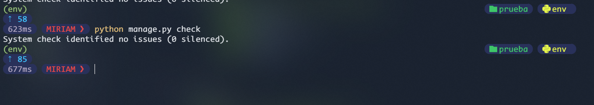
En caso de errores escribeme directo y te ayudo a resolverlos

25. Haremos las migraciones y con ello podrás verificar que se ha creado una tabla llamada libros en la base de datos creada previamente, escribimos los siguientes comandos, el primero es para crear el archivo de migraciones y el segundo para hacer la migración a la base de datos:

        > python manage.py makemigrations
        > python manage.py migrate

26. En la carpeta library veremos que se ha creado una carpeta de migrations y en la base de datos veremos nuestra tabla:
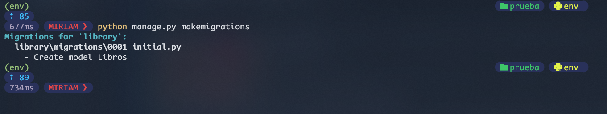
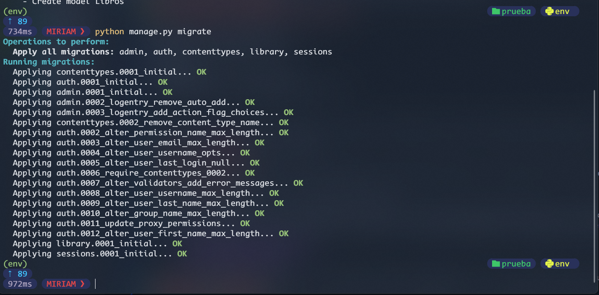
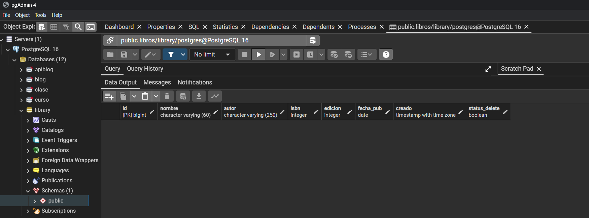

27. Si haz llegado hasta aquí, **FELICIDADES** has creado tu primera API con Backend Django REST Framework, ahora si puedes levantar el servidor y desde Postman hacer tus consultas:

        > python manage.py runserver

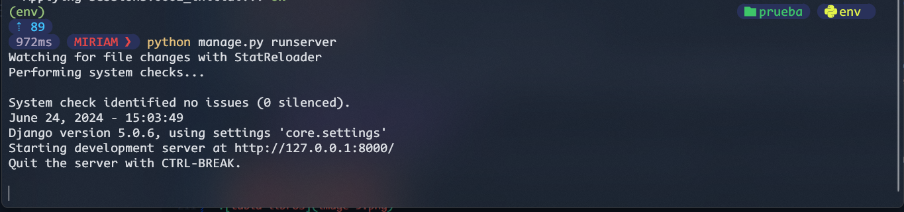
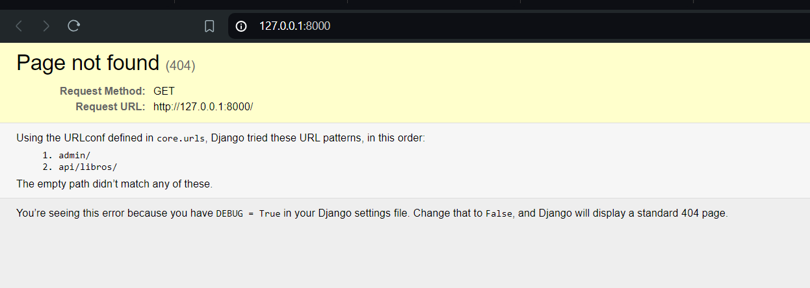
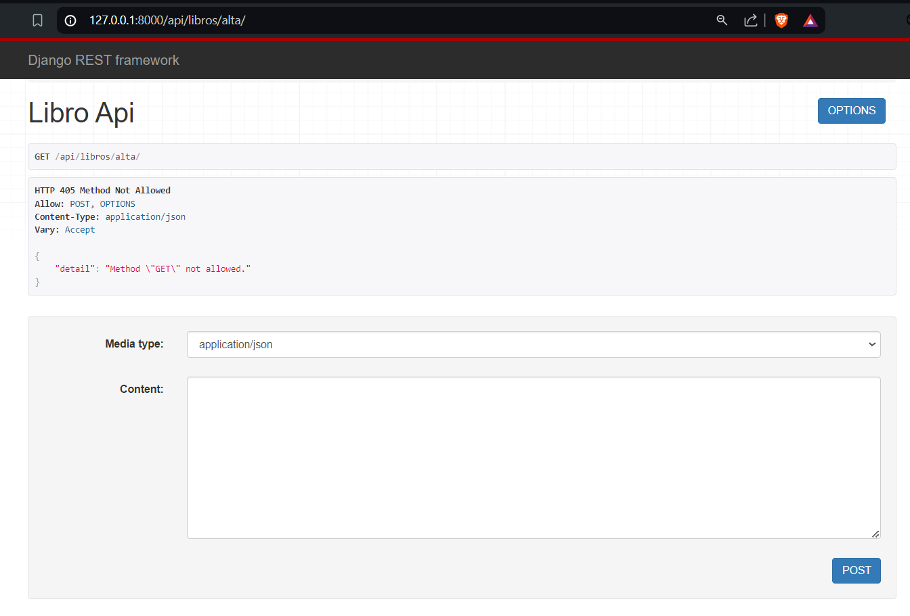
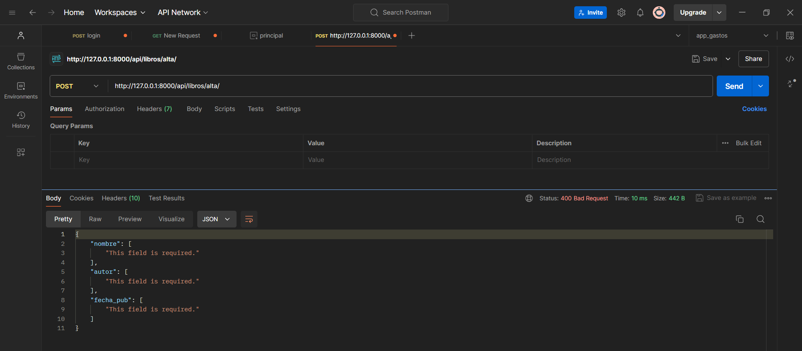

28. Como podrás ver, ya podemos hacer consultas, ya solo queda que tu pruebes que haz hecho todo bien hasta aquí.

Sí tienes alguna otra duda, escribeme directamente. 

---
### Creador
Tutorial hecho con ❤️ por [Miriam Zamora Morales](https://github.com/MiriamZamoraM). Siempre abierta a colaboraciones, nuevas ideas y retos.
